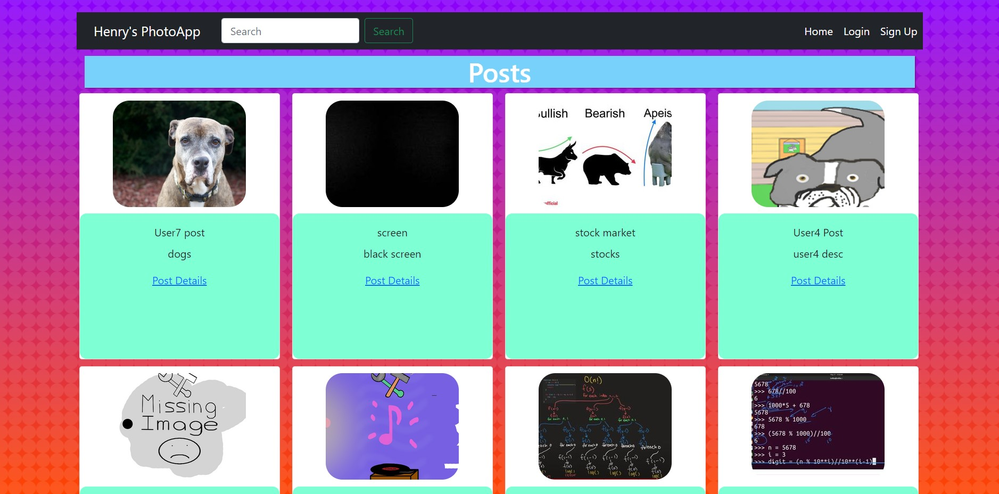
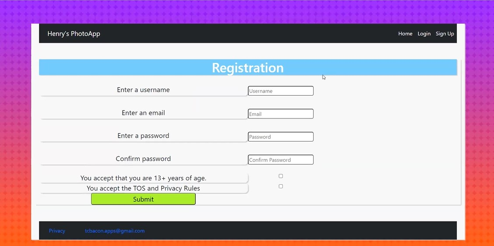
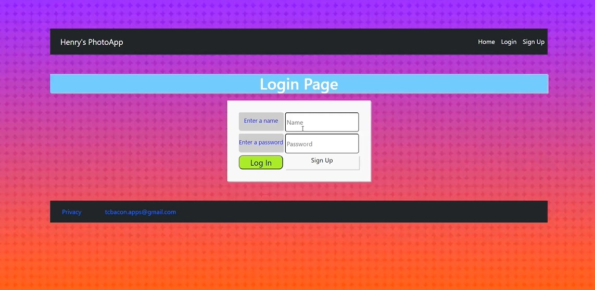

# Photo App Project

## Photo app made for school project.

# MySQL Tables
<ul>
<li>comments</li>
<li>posts</li>
<li>users</li>
</ul>

The schema can be found in dbloader file inside bin folder.

# Env File

Environmental Variables are stored in .temp.env

# Build/Run Instructions

## Build Instructions
1. cd into application
2. npm install

## Run Instructions
1. cd into application
2. npm start

## Main Libraries Used
<ul>
<li>express</li>
<li>bycrypt</li>
<li>multer</li>
<li>mysql2</li>
<li>express-handlebars</li>
<li>express-mysql-session</li>
<li>express-session</li>
<li>dotenv</li>
<li>cookie-parser</li>
</ul>

## Images
<h3>Home Page</h3>

<h3>Registration Page</h3>

<h3>Login Page</h3>

# Deployed Sites

Link to the deployed site shown in this repository.

<a href="https://photo-app-henry.herokuapp.com/">Photo App Site</a>

 

I also made another photo app site to learn more about React, which you can visit at the link below.

<a href="https://atann.netlify.app/posts">MERN Stack Photo App</a>